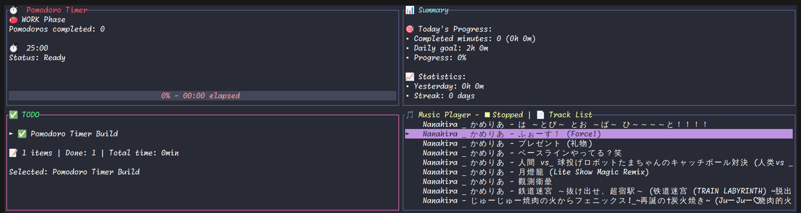

# Sessio

This is a [Ratatui] Pomodoro Timer with Music Player

A terminal-based productivity suite with Pomodoro timer, todo management, and music player functionality.

# Screenshot



## Features

Press ? to show all help message

### 🍅 Pomodoro Timer (Top-Left Panel)
- 25-minute work sessions with 5-minute short breaks
- 15-minute long breaks every 4th session
- Automatic time tracking to selected todo items
- Timer controls: Space (start/pause), R (reset), Shift+S (skip phase)

### ✅ Todo Management (Bottom-Left Panel)
- Add, edit, and manage tasks
- Automatic time logging from Pomodoro sessions
- Undo functionality and task completion tracking
- Navigation: hjkl, a (add), d (done), D (delete), S (select for timer)

### 📊 Daily Summary (Top-Right Panel)
- Shows daily statistics and productivity metrics
- Tracks work streaks and session history

### 🎵 Music Player (Bottom-Right Panel)
- Automatically discovers music files in your Music folder
- Supports: MP3, WAV, FLAC, M4A, AAC, OGG formats
- Music library scanning with depth limit for performance
- Playback controls with visual feedback

## Music Player Controls

When focused on the Music Player panel (bottom-right):
- **j/k**: Navigate up/down in track list
- **Space**: Play/Pause current track
- **Enter**: Play selected track  
- **m**: Switch between playback order
- **n**: Next track
- **p**: Previous track
- **R**: Refresh music library (Shift+R)

## Music Folder Setup

The application automatically looks for music files in:
1. System audio directory (usually `~/Music`)
2. `~/Music` as fallback
3. `./music` in the current directory

To test with sample music:
1. Create a `~/Music` folder
2. Add your audio files (MP3, FLAC, etc.)
3. Press `R` (Shift+R) in the music panel to refresh

## Navigation

- **HJKL**: Move between panels (uppercase for panel switching)
- **hjkl**: Navigate within panels (lowercase for internal navigation)
- **?**: Show/hide help
- **q**: Quit application

## Dependencies

- `rodio`: Audio playback functionality
- `walkdir`: Filesystem traversal for music discovery
- `dirs`: Cross-platform directory detection
- `ratatui`: Terminal UI framework
- `crossterm`: Cross-platform terminal manipulation

## Running the Application

```bash
cargo run
```

## Architecture

The application uses a quadrant-based layout:
```
┌─────────────┬─────────────┐
│   Timer     │   Summary   │
│ (Top-Left)  │ (Top-Right) │
├─────────────┼─────────────┤
│    Todo     │   Music     │
│(Bottom-Left)│(Bottom-Right)│
└─────────────┴─────────────┘
```

Each panel is independently navigable and focused, with context-aware keybindings based on the currently focused quadrant.].

[Ratatui]: https://ratatui.rs
[Hello World Template]: https://github.com/ratatui/templates/tree/main/hello-world

## License

Copyright (c) zyl

This project is licensed under the MIT license ([LICENSE] or <http://opensource.org/licenses/MIT>)

[LICENSE]: ./LICENSE

## TODO
- [ ] alarm sound
- [ ] theme config
- [ ] pomodoro timer data save